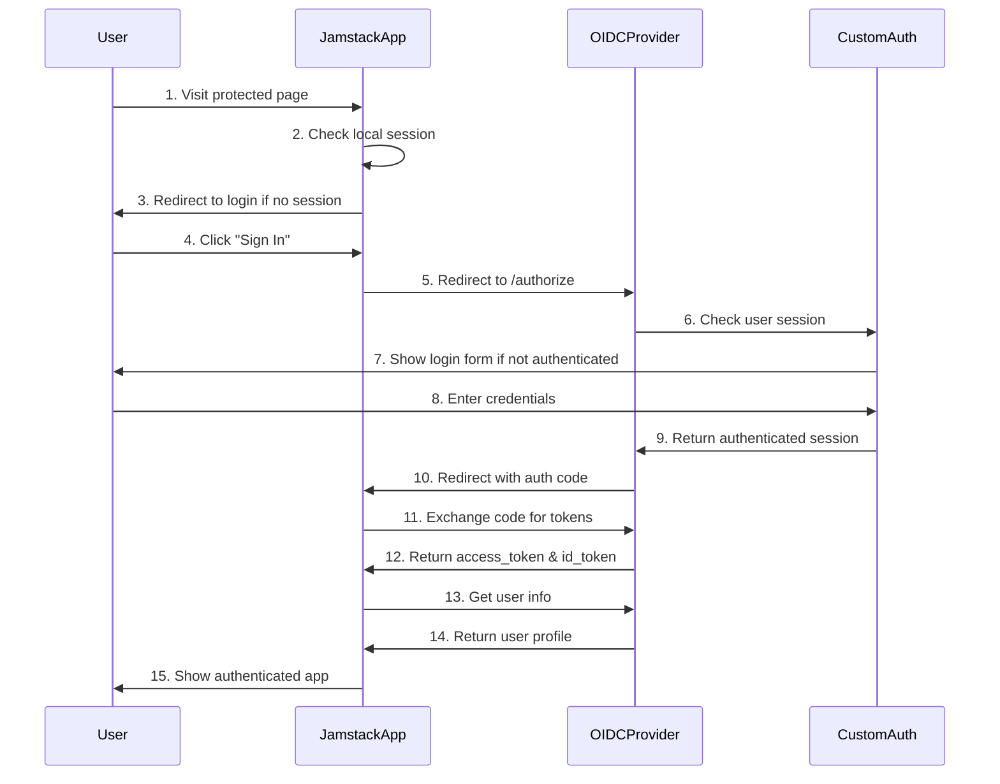

# Jamstack App Integration with Custom OIDC Provider

## Overview
This guide explains how a Jamstack application (Next.js, Nuxt, Gatsby, etc.) can register and integrate with your custom OIDC provider to implement authentication.

## Step 1: Register Your Jamstack App as OIDC Client

### 1.1 Client Registration Process

First, you need to register your Jamstack app in your OIDC provider's configuration:

**Update `config.yml`:**
```yaml
clients:
  # ... existing clients ...
  
  - name: "My Jamstack App"
    client_id: "jamstack-app-12345"  # Generate unique UUID
    client_secret_key: "SECRET_JAMSTACK_APP"  # Environment variable name
    redirect_uris:
      - "https://myapp.com/auth/callback"
      - "http://localhost:3000/auth/callback"  # For development
    cors_origins:
      - "https://myapp.com"
      - "http://localhost:3000"
    post_logout_redirect_uris:
      - "https://myapp.com"
      - "http://localhost:3000"
```

**Set Client Secret:**
```bash
# Deploy the secret to your Worker
wrangler secret put SECRET_JAMSTACK_APP
# Enter your secure client secret when prompted
```

### 1.2 OIDC Discovery Endpoint

Your Jamstack app will use the discovery endpoint to get configuration:
```
https://your-oidc-provider.workers.dev/.well-known/openid-configuration
```

This returns:
```json
{
  "issuer": "https://your-oidc-provider.workers.dev",
  "authorization_endpoint": "https://your-oidc-provider.workers.dev/authorize",
  "token_endpoint": "https://your-oidc-provider.workers.dev/token",
  "userinfo_endpoint": "https://your-oidc-provider.workers.dev/userinfo",
  "jwks_uri": "https://your-oidc-provider.workers.dev/.well-known/jwks.json",
  "response_types_supported": ["code", "id_token", "code id_token"],
  "grant_types_supported": ["authorization_code"],
  "subject_types_supported": ["public"]
}
```

## Step 2: Jamstack App Implementation Examples

### 2.1 Next.js with NextAuth.js

**Install Dependencies:**
```bash
npm install next-auth
```

**`pages/api/auth/[...nextauth].js`:**
```javascript
import NextAuth from 'next-auth'

export default NextAuth({
  providers: [
    {
      id: "custom-oidc",
      name: "Your OIDC Provider",
      type: "oauth",
      version: "2.0",
      wellKnown: "https://your-oidc-provider.workers.dev/.well-known/openid-configuration",
      authorization: {
        params: {
          scope: "openid email profile",
          response_type: "code",
        },
      },
      clientId: process.env.OIDC_CLIENT_ID,
      clientSecret: process.env.OIDC_CLIENT_SECRET,
      idToken: true,
      checks: ["pkce", "state"],
      profile(profile) {
        return {
          id: profile.sub,
          name: profile.name,
          email: profile.email,
          image: profile.picture,
        }
      },
    }
  ],
  session: {
    strategy: "jwt",
  },
  callbacks: {
    async jwt({ token, account, profile }) {
      if (account) {
        token.accessToken = account.access_token
        token.idToken = account.id_token
      }
      return token
    },
    async session({ session, token }) {
      session.accessToken = token.accessToken
      session.idToken = token.idToken
      return session
    },
  },
})
```

**Environment Variables (`.env.local`):**
```env
NEXTAUTH_URL=http://localhost:3000
NEXTAUTH_SECRET=your-nextauth-secret
OIDC_CLIENT_ID=jamstack-app-12345
OIDC_CLIENT_SECRET=your-client-secret
```

**Using Authentication in Components:**
```jsx
// pages/index.js
import { useSession, signIn, signOut } from 'next-auth/react'

export default function Home() {
  const { data: session, status } = useSession()

  if (status === "loading") return <p>Loading...</p>

  if (session) {
    return (
      <>
        <p>Signed in as {session.user.email}</p>
        <button onClick={() => signOut()}>Sign out</button>
        <pre>{JSON.stringify(session, null, 2)}</pre>
      </>
    )
  }
  
  return (
    <>
      <p>Not signed in</p>
      <button onClick={() => signIn("custom-oidc")}>Sign in</button>
    </>
  )
}
```

### 2.2 Nuxt.js with Auth Module

**Install Dependencies:**
```bash
npm install @nuxtjs/auth-next @nuxtjs/axios
```

**`nuxt.config.js`:**
```javascript
export default {
  modules: [
    '@nuxtjs/axios',
    '@nuxtjs/auth-next'
  ],
  
  auth: {
    strategies: {
      customOidc: {
        scheme: 'oauth2',
        endpoints: {
          authorization: 'https://your-oidc-provider.workers.dev/authorize',
          token: 'https://your-oidc-provider.workers.dev/token',
          userInfo: 'https://your-oidc-provider.workers.dev/userinfo',
          logout: false
        },
        token: {
          property: 'access_token',
          type: 'Bearer',
          maxAge: 1800
        },
        refreshToken: {
          property: 'refresh_token',
          maxAge: 60 * 60 * 24 * 30
        },
        responseType: 'code',
        grantType: 'authorization_code',
        clientId: process.env.OIDC_CLIENT_ID,
        scope: ['openid', 'profile', 'email'],
        codeChallengeMethod: 'S256'
      }
    },
    redirect: {
      login: '/auth/login',
      logout: '/',
      callback: '/auth/callback',
      home: '/dashboard'
    }
  },
  
  publicRuntimeConfig: {
    auth: {
      strategies: {
        customOidc: {
          clientId: process.env.OIDC_CLIENT_ID
        }
      }
    }
  }
}
```

**Using in Vue Components:**
```vue
<template>
  <div>
    <div v-if="$auth.loggedIn">
      <p>Welcome {{ $auth.user.name }}!</p>
      <button @click="$auth.logout()">Logout</button>
    </div>
    <div v-else>
      <button @click="$auth.loginWith('customOidc')">Login</button>
    </div>
  </div>
</template>
```

### 2.3 Vanilla JavaScript SPA

**HTML Structure:**
```html
<!DOCTYPE html>
<html>
<head>
    <title>My Jamstack App</title>
</head>
<body>
    <div id="app">
        <div id="login-section" style="display: none;">
            <button id="login-btn">Sign In with OIDC</button>
        </div>
        <div id="user-section" style="display: none;">
            <h2>Welcome!</h2>
            <pre id="user-info"></pre>
            <button id="logout-btn">Sign Out</button>
        </div>
    </div>
    <script src="auth.js"></script>
</body>
</html>
```

**JavaScript Implementation (`auth.js`):**
```javascript
class OIDCClient {
    constructor() {
        this.config = {
            clientId: 'jamstack-app-12345',
            redirectUri: window.location.origin + '/auth/callback',
            scope: 'openid profile email',
            responseType: 'code',
            issuer: 'https://your-oidc-provider.workers.dev'
        };
        this.init();
    }

    async init() {
        // Check if we're returning from authorization
        if (window.location.pathname === '/auth/callback') {
            await this.handleCallback();
            return;
        }

        // Check existing session
        const token = localStorage.getItem('access_token');
        if (token) {
            await this.loadUserInfo();
        } else {
            this.showLogin();
        }
    }

    showLogin() {
        document.getElementById('login-section').style.display = 'block';
        document.getElementById('user-section').style.display = 'none';
        
        document.getElementById('login-btn').onclick = () => this.login();
    }

    showUser(userInfo) {
        document.getElementById('login-section').style.display = 'none';
        document.getElementById('user-section').style.display = 'block';
        document.getElementById('user-info').textContent = JSON.stringify(userInfo, null, 2);
        
        document.getElementById('logout-btn').onclick = () => this.logout();
    }

    // Generate PKCE challenge for security
    generateCodeChallenge() {
        const codeVerifier = this.generateRandomString(128);
        localStorage.setItem('code_verifier', codeVerifier);
        
        return crypto.subtle.digest('SHA-256', new TextEncoder().encode(codeVerifier))
            .then(hash => btoa(String.fromCharCode(...new Uint8Array(hash)))
                .replace(/\+/g, '-').replace(/\//g, '_').replace(/=/g, ''));
    }

    generateRandomString(length) {
        const chars = 'ABCDEFGHIJKLMNOPQRSTUVWXYZabcdefghijklmnopqrstuvwxyz0123456789-._~';
        let result = '';
        for (let i = 0; i < length; i++) {
            result += chars.charAt(Math.floor(Math.random() * chars.length));
        }
        return result;
    }

    async login() {
        const state = this.generateRandomString(32);
        const codeChallenge = await this.generateCodeChallenge();
        
        localStorage.setItem('auth_state', state);

        const params = new URLSearchParams({
            client_id: this.config.clientId,
            redirect_uri: this.config.redirectUri,
            scope: this.config.scope,
            response_type: this.config.responseType,
            state: state,
            code_challenge: codeChallenge,
            code_challenge_method: 'S256'
        });

        window.location.href = `${this.config.issuer}/authorize?${params}`;
    }

    async handleCallback() {
        const urlParams = new URLSearchParams(window.location.search);
        const code = urlParams.get('code');
        const state = urlParams.get('state');
        const storedState = localStorage.getItem('auth_state');

        if (!code || state !== storedState) {
            throw new Error('Invalid callback parameters');
        }

        // Exchange code for tokens
        const codeVerifier = localStorage.getItem('code_verifier');
        const response = await fetch(`${this.config.issuer}/token`, {
            method: 'POST',
            headers: {
                'Content-Type': 'application/x-www-form-urlencoded',
            },
            body: new URLSearchParams({
                grant_type: 'authorization_code',
                client_id: this.config.clientId,
                code: code,
                redirect_uri: this.config.redirectUri,
                code_verifier: codeVerifier
            })
        });

        const tokens = await response.json();
        
        if (tokens.access_token) {
            localStorage.setItem('access_token', tokens.access_token);
            localStorage.setItem('id_token', tokens.id_token);
            
            // Clean up
            localStorage.removeItem('auth_state');
            localStorage.removeItem('code_verifier');
            
            // Redirect back to main app
            window.location.href = '/';
        }
    }

    async loadUserInfo() {
        const token = localStorage.getItem('access_token');
        
        try {
            const response = await fetch(`${this.config.issuer}/userinfo`, {
                headers: {
                    'Authorization': `Bearer ${token}`
                }
            });
            
            if (response.ok) {
                const userInfo = await response.json();
                this.showUser(userInfo);
            } else {
                this.logout();
            }
        } catch (error) {
            console.error('Failed to load user info:', error);
            this.logout();
        }
    }

    logout() {
        localStorage.removeItem('access_token');
        localStorage.removeItem('id_token');
        this.showLogin();
    }
}

// Initialize the OIDC client
new OIDCClient();
```

## Step 3: Authentication Flow Walkthrough

### 3.1 Complete Flow Sequence



### 3.2 Key URLs and Parameters

**Authorization URL:**
```
https://your-oidc-provider.workers.dev/authorize?
  client_id=jamstack-app-12345&
  redirect_uri=https://myapp.com/auth/callback&
  scope=openid%20profile%20email&
  response_type=code&
  state=random-state-value&
  code_challenge=challenge&
  code_challenge_method=S256
```

**Token Exchange:**
```http
POST /token
Content-Type: application/x-www-form-urlencoded

grant_type=authorization_code&
client_id=jamstack-app-12345&
client_secret=your-secret&
code=auth-code-from-callback&
redirect_uri=https://myapp.com/auth/callback&
code_verifier=pkce-verifier
```

## Step 4: Security Best Practices

### 4.1 PKCE (Proof Key for Code Exchange)
Always use PKCE for public clients (SPAs):
```javascript
// Generate code verifier and challenge
const codeVerifier = generateRandomString(128);
const codeChallenge = await sha256(codeVerifier);
```

### 4.2 State Parameter
Prevent CSRF attacks:
```javascript
const state = generateRandomString(32);
localStorage.setItem('auth_state', state);
// Include in authorization URL
```

### 4.3 Secure Token Storage
- **Server-side apps**: Use secure HTTP-only cookies
- **SPAs**: Use secure storage (consider risks of localStorage)
- **Always**: Use HTTPS in production

### 4.4 Token Validation
```javascript
// Validate ID token (simplified)
function validateIdToken(idToken) {
    const [header, payload, signature] = idToken.split('.');
    const decodedPayload = JSON.parse(atob(payload));
    
    // Check expiry
    if (decodedPayload.exp < Date.now() / 1000) {
        throw new Error('Token expired');
    }
    
    // Check issuer
    if (decodedPayload.iss !== 'https://your-oidc-provider.workers.dev') {
        throw new Error('Invalid issuer');
    }
    
    // Check audience
    if (decodedPayload.aud !== 'jamstack-app-12345') {
        throw new Error('Invalid audience');
    }
}
```

## Step 5: Error Handling

### 5.1 Common Error Scenarios

**Invalid Client:**
```json
{
  "error": "invalid_client",
  "error_description": "Client authentication failed"
}
```

**Invalid Grant:**
```json
{
  "error": "invalid_grant",
  "error_description": "Authorization code is invalid or expired"
}
```

**Access Denied:**
```json
{
  "error": "access_denied",
  "error_description": "User denied authorization"
}
```

### 5.2 Error Handling in Code

```javascript
async function handleTokenResponse(response) {
    const data = await response.json();
    
    if (!response.ok) {
        switch (data.error) {
            case 'invalid_client':
                console.error('Client configuration error');
                break;
            case 'invalid_grant':
                console.error('Authorization code expired, retry login');
                window.location.href = '/login';
                break;
            case 'access_denied':
                console.error('User denied access');
                break;
            default:
                console.error('Unknown error:', data.error_description);
        }
        throw new Error(data.error_description);
    }
    
    return data;
}
```

## Step 6: Testing Your Integration

### 6.1 Test Checklist
- [ ] Authorization redirect works
- [ ] Token exchange succeeds
- [ ] User info retrieval works
- [ ] Logout clears session
- [ ] Token refresh works (if implemented)
- [ ] Error handling works correctly
- [ ] PKCE validation works
- [ ] State parameter validation works

### 6.2 Development Setup
```bash
# Start your Jamstack app
npm run dev

# Test the flow
# 1. Visit http://localhost:3000
# 2. Click sign in
# 3. Complete authentication
# 4. Verify redirect back to app
# 5. Check user info display
```

This integration approach gives you a complete OIDC authentication flow for your Jamstack application while maintaining security best practices and providing a seamless user experience.
